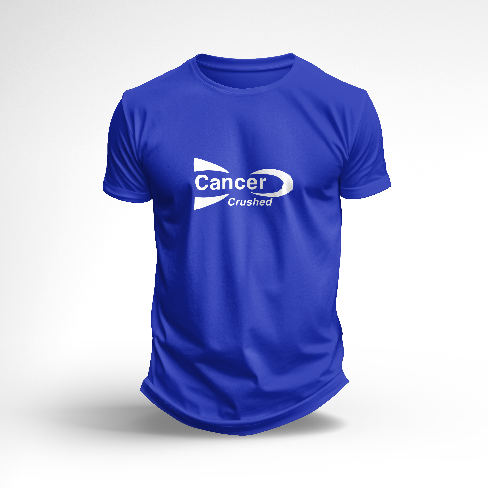
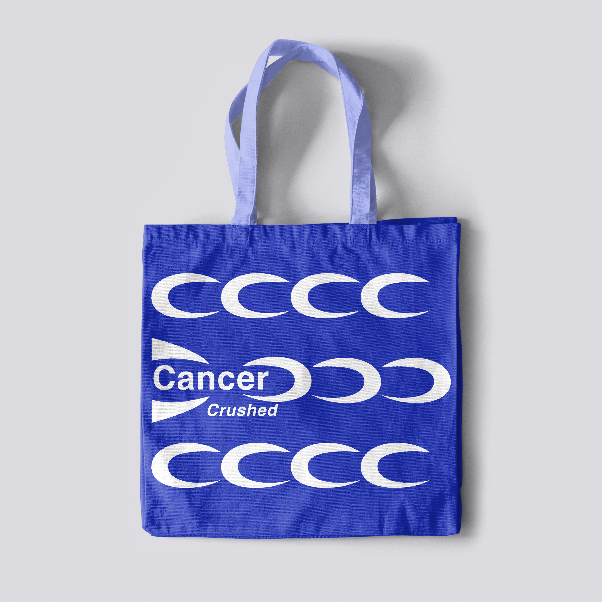

# project3_socialjusticefestival

## project overview
This project involves creating a hypothetical festival event about a social cause of our choice. My social justice festival, Cancer Crushed, is partnering with American Cancer Society, aiming to educate and raise awareness about cancer and cancer prevention, detail the latest research in cancer prevention and medication, and to foster a sense of community between cancer patients, family, and interested individuals.  

I chose to promote the topic of cancer education because of how unspoken the topic is in today's society. Cancer is more prevelant than we suspect. Many of us are or may be affected by cancer, whether developing cancer ourselves or knowing someone who will. This festival supports all of these individuals by providing education, both about cancer itself but also about daily habits for cancer prevention, and by fostering a sense of community, among those who have cancer or have had cancer and also among caretakers, family, and friends, of those who have or have had cancer.

## techinical overview
This long-scroll webpage is coded with HTML and CSS in Visual Studio Code and hosted on GitHub. 
Github link: https://mkahn0.github.io/project3_socialjusticefestival/. 

## process work

Black + White Wireframes:

Color Wireframes:

<a href="https://drive.google.com/file/d/1fKsFZ1ArTScYDgx3rYnQGhGNMVyrq3f0/view?usp=sharing">Brand Guide</a>

Mockups:
<li>T-shirt: </li>
<li>Tote Bag: </li>
<li>Notebook: </li>

## acknowledgement
Fonts used: 
<li><a href="https://fonts.google.com/specimen/Roboto">Roboto</a></li>
<li><a href="https://fonts.google.com/specimen/Roboto+Condensed">Roboto Condensed</a></li>

This festival is in partnership with the American Cancer Society: https://www.cancer.org/ 

Tutorials Referenced:
<li><a href="https://www.w3schools.com/cssref/pr_scroll-behavior.php">W3 Schools: Scroll-Behavior Property</a> - Used in masterstyle.css.</li>

Images:
Stacked hands (background image): 
Generated via AI in Photoshop. Prompt: "team huddle stacked hands". 